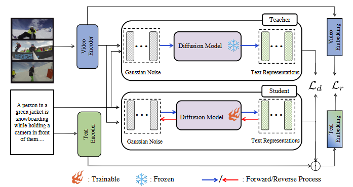

# TextDiff: Unleashing Text Potentials for Text-Video Retrieval 

---

> **Abstract:** *Despite the recent surge in advancements in text-video retrieval technology, the full potential of textual data remains unleashed. To address the lack of textual information compared to visual information, existing studies have explored various strategies to expand text semantics. However, nearly all semantic extension approaches are limited to the text domain and heavily rely on rule-based or model-based imagination. This limitation constrains the scope of semantic understanding and results in a disconnection between expanded text semantics and the visual domain.
>
> Inspired by the diffusion model, we posit that the text in the TVR task can function as the source domain, and the diffusion process can be conducted under the guidance of visual constraints. This approach facilitates a natural connection between text and the visual domain, enabling the semantic reach of text to extend beyond the limitations of the textual realm, ultimately resulting in a more adaptable and expansive semantic expansion. Specifically, we introduce a visual-guided text modeling method called \textbf{TextDiff}, which employs continuous diffusion to propel text embeddings toward the visual direction based on the proximity between visual and text embeddings. This diffusion process operates under two constraints: retrieval loss and teacher supervision loss. The teacher constraints ensure that the diffusion process remains closely aligned with the original trajectory, thereby stabilizing the training. Extensive experiments on four commonly used text-video retrieval benchmarks (including MSRVTT, DiDeMo, LSMDC, ActivityNet Captions) demonstrate the effectiveness of our approach, achieving superior performance.*

>

> 
> 

---

## Content

1. [Dependencies](#Dependencies)
1. [Diffusion](#Diffusion)
1. [Dataset](#Dataset)
1. [Evaluation](#Evaluation)
1. [Training](#Training)

## Dependencies

- PyTorch 1.12.1 
- OpenCV 4.7.0
- transformers 4.30.2
- mpi4py  3.0.1

## Diffusion

Get the weights of our trained diffusion model [link](https://drive.google.com/drive/folders/1B_BsN0lxGoRb0XOA9wo-EH8ipqAVvdWg?usp=sharing) and into  `./Diffusion-LM/diffusion_models`

## Dataset

| Dataset | Video Clips | Text-Video Pairs | Link |
|:-----------:|:-----------:| :-----------: | :-----------: |
|MSR-VTT|10K|one-to-twenty|[link](https://github.com/ArrowLuo/CLIP4Clip)|
|LSMDC|118081|one-to-one|[link](https://github.com/ArrowLuo/CLIP4Clip)|
|DiDeMo|10464|one-to-many|[link](https://drive.google.com/drive/u/1/folders/1_oyJ5rQiZboipbMl6tkhY8v0s9zDkvJc)|
|ActivityNet|20K|one-to-many|[link](https://github.com/jpthu17/EMCL)|

## Evaluation

Download the checkpoints into `./outputs/{Dataset}/{FOLDER_NAME_UNDER_*Dataset*}`. 

We adopt `--seed=24` and `--diffusion_steps=10` for all methods. The evaluation is default to text-to-video retrieval performance (i.e., `--metric=t2v`), for video-to-text retrieval performance, specify `--metric=v2t`. 

Replace `{videos_dir}` with the path to the dataset.

| Dataset | Command | t2v R@1 Result |
|:-----------:|:-----------:| :-----------: |
|MSR-VTT-9k|`python test.py --datetime={FOLDER_NAME_UNDER_MSR-VTT-9k}  --videos_dir={VIDEO_DIR}  --batch_size=32 --noclip_lr=1e-7 --transformer_dropout=0.3  --dataset_name=MSRVTT --msrvtt_train_file=9k   --gpu='0'  --load_epoch=0   --exp_name=MSR-VTT-9k --diffusion_steps=10`| 54.3 |
|LSMDC|`python test.py  --exp_name=LSMDC --videos_dir={VIDEO_DIR}  --batch_size=32 --noclip_lr=1e-7 --transformer_dropout=0.3 --dataset_name=LSMDC --gpu='0' --num_epochs=5   --load_epoch=0 --datetime={FOLDER_NAME_UNDER_LSMDC} --diffusion_steps=10`|32.13|
|DiDeMo|`python test.py  --num_frame=12 --raw_video  --exp_name=DiDeMo --videos_dir={VIDEO_DIR} --batch_size=32 --noclip_lr=1e-7 --transformer_dropout=0.4  --dataset_name=DiDeMo  --gpu='0' --num_epochs=5   --load_epoch=0 --datetime={FOLDER_NAME_UNDER_DiDeMo} --diffusion_steps=10`|52.88|
|ActivityNet|`python test.py --exp_name=ActivityNet --videos_dir={VIDEO_DIR}  --batch_size=32 --noclip_lr=1e-7 --transformer_dropout=0.3 --dataset_name=ActivityNet --gpu='0' --num_epochs=5   --load_epoch=0 --datetime={FOLDER_NAME_UNDER_LSMDC} --diffusion_steps=10`|52.8|

## Training 
Run the following training code to resume the above results.  the evaluation is by default set to generate results for text-to-video retrieval (t2v). For video-to-text retrieval (v2t) results, add the argument `--metric=v2t` to the command. Also, replace `{VIDEO_DIR}` with the path to the dataset's videos.

| Dataset | Command |
|:-----------:|:-----------:|
|MSR-VTT-9k|`python train.py --exp_name=MSR-VTT-9k --videos_dir={VIDEO_DIR}  --batch_size=32 --noclip_lr=1e-7 --transformer_dropout=0.3  --dataset_name=MSRVTT --msrvtt_train_file=9k  --gpu='0' --num_epochs=5  --diffusion_steps=10 `|
|LSMDC|`python train.py --exp_name=LSMDC --videos_dir={VIDEO_DIR}  --batch_size=32 --noclip_lr=1e-7 --transformer_dropout=0.3 --dataset_name=LSMDC   --gpu='0'  --num_epochs=5  --diffusion_steps=10`|
|DiDeMo|`python train.py  --num_frame=12 --raw_video --exp_name=DiDeMo --videos_dir={VIDEO_DIR} --batch_size=32 --noclip_lr=1e-7 --transformer_dropout=0.4 --dataset_name=DiDeMo  --gpu='0' --num_epochs=5  --diffusion_steps=10`|
|ActivityNet|`python train.py --exp_name=ActivityNet --videos_dir={VIDEO_DIR} --batch_size=32 --noclip_lr=1e-7 --transformer_dropout=0.4 --dataset_name=ActivityNet  --gpu='0' --num_epochs=5  --diffusion_steps=10`|
